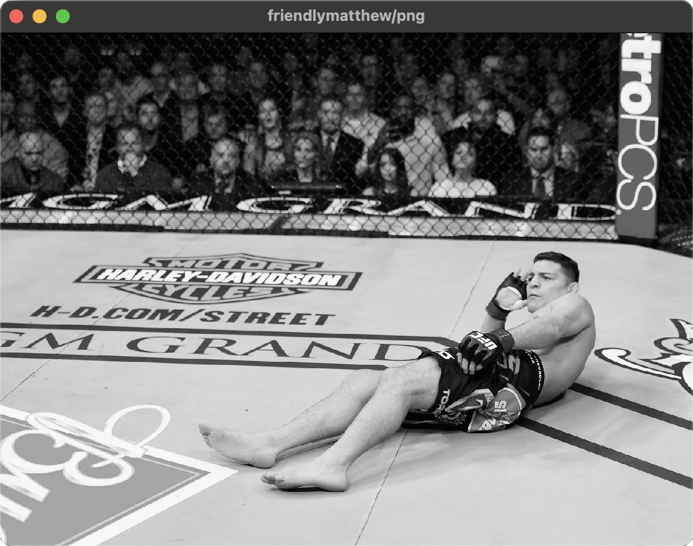
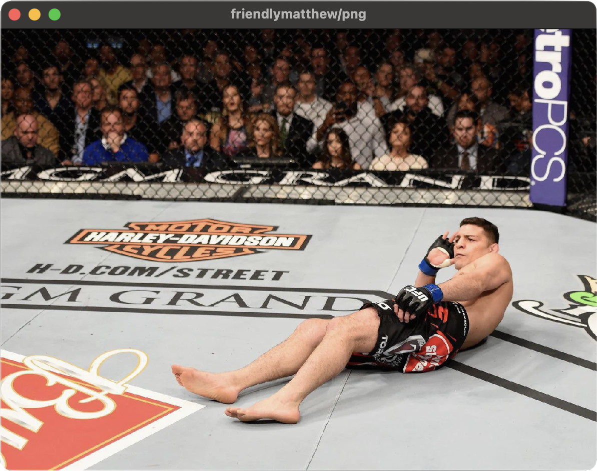

# png

<p align="center">
    
    
    
</p>

This project aims to provide a PNG decoder backed by a feature-rich GPU-based renderer.

As a decoder, this project uses the [PNG test suite](http://www.schaik.com/pngsuite/) to validate its ability to handle
various PNG features and edge cases. Currently, `png` can decode and render images with an 8-bit color depth.

The renderer handles various image processing features on the GPU like triggering various color tones, applying gaussian
blur, and resizing.

## Usage

To render an image, run `cargo run --release <image_path>`. For example:

```bash
cargo run --release ./tests/obama.png
```

### Additional Scripts

```bash
# Run the PNG test suite
cargo r --bin png-test-suite

# Profile the decoder
./profile_decoder.sh ./tests/reagan.png

# Fuzz the decoder
./fuzz.sh
```

## Reading

### PNG Specification

http://www.libpng.org/pub/png/pngintro.html<br>
https://www.w3.org/TR/2003/REC-PNG-20031110/<br>
http://www.libpng.org/pub/png/pngpic2.html<br>
https://www.w3.org/Graphics/PNG/platform.html<br>

### GPU Rendering

https://sotrh.github.io/learn-wgpu/beginner/tutorial5-textures/<br>

### Image Processing

https://www.cns.nyu.edu/pub/lcv/wang03-preprint.pdf<br>
https://www.cns.nyu.edu/pub/eero/wang03b.pdf<br>
https://ece.uwaterloo.ca/~z70wang/research/ssim/<br>
http://arxiv.org/pdf/2006.13846<br>

https://www.youtube.com/watch?v=KuXjwB4LzSA<br>
https://www.shadertoy.com/view/4tSyzy<br>