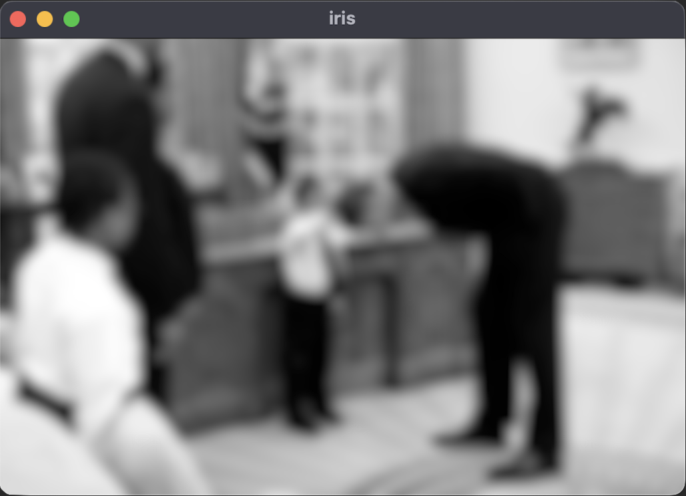
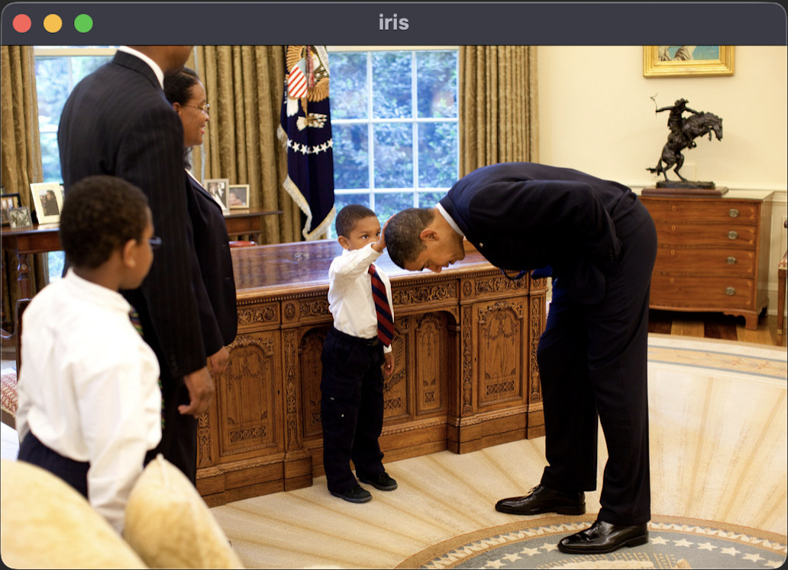
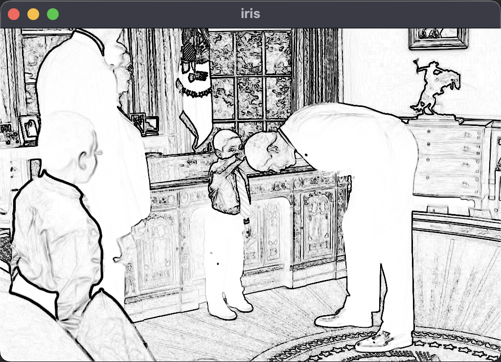

# iris

<p align="center">
    
    
    
</p>
<br>

A PNG editor from scratch (well, as close to scratch as possible).

As a decoder, this project uses the [PNG test suite](http://www.schaik.com/pngsuite/) to validate its ability to handle
various PNG features and edge cases. Currently, iris can decode and render images with an 8-bit color depth.

The renderer supports various image processing features on the GPU.

## Usage

Run `cargo run --release <image_path>`. For example:

```bash
cargo r --release ./tests/obama.png
```

### Additional Scripts

```bash

# Profile the decoder
./profile_decoder.sh ./tests/reagan.png

# Run ad-hoc benchmarks
cargo r --release --bin iris-decode --features time ./tests/Periodic_table_large.png

# Parse and render glyphs from the lato font file
# See the generated `glyph_playground` directory.
cargo r --bin iris-lato-glyphs hfkdp!

# Run the PNG test suite
cargo r --bin iris-png-test-suite

# Fuzz the decoder
./fuzz.sh
```

## Reading

### PNG Specification

https://www.w3.org/TR/2003/REC-PNG-20031110/<br>
http://www.libpng.org/pub/png/pngintro.html<br>
https://www.w3.org/Graphics/PNG/platform.html<br>
https://optipng.sourceforge.net/pngtech/optipng.html<br>
https://optipng.sourceforge.net/pngtech/better-filtering.html<br>
http://www.libpng.org/pub/png/pngpic2.html<br>
https://www.lucaversari.it/FJXL_and_FPNGE.pdf<br>

### GPU Programming

https://sotrh.github.io/learn-wgpu/beginner/tutorial5-textures/<br>
https://raphlinus.github.io/gpu/2020/02/12/gpu-resources.html<br>

### Image Processing

https://www.youtube.com/watch?v=KuXjwB4LzSA<br>
https://www.shadertoy.com/view/4tSyzy<br>
https://www.shadertoy.com/view/wsK3Wt<br>

https://www.cns.nyu.edu/pub/lcv/wang03-preprint.pdf<br>
https://www.cns.nyu.edu/pub/eero/wang03b.pdf<br>
https://ece.uwaterloo.ca/~z70wang/research/ssim/<br>
http://arxiv.org/pdf/2006.13846<br>

### TrueType Font Rendering

https://faultlore.com/blah/text-hates-you/<br>
https://developer.apple.com/fonts/TrueType-Reference-Manual/<br>
https://www.youtube.com/watch?v=SO83KQuuZvg<br>
https://www.microsoft.com/en-us/research/wp-content/uploads/2005/01/p1000-loop.pdf<br>
https://medium.com/@evanwallace/easy-scalable-text-rendering-on-the-gpu-c3f4d782c5ac<br>

### Miscellaneous

https://www.joelonsoftware.com/2003/10/08/the-absolute-minimum-every-software-developer-absolutely-positively-must-know-about-unicode-and-character-sets-no-excuses/<br>
