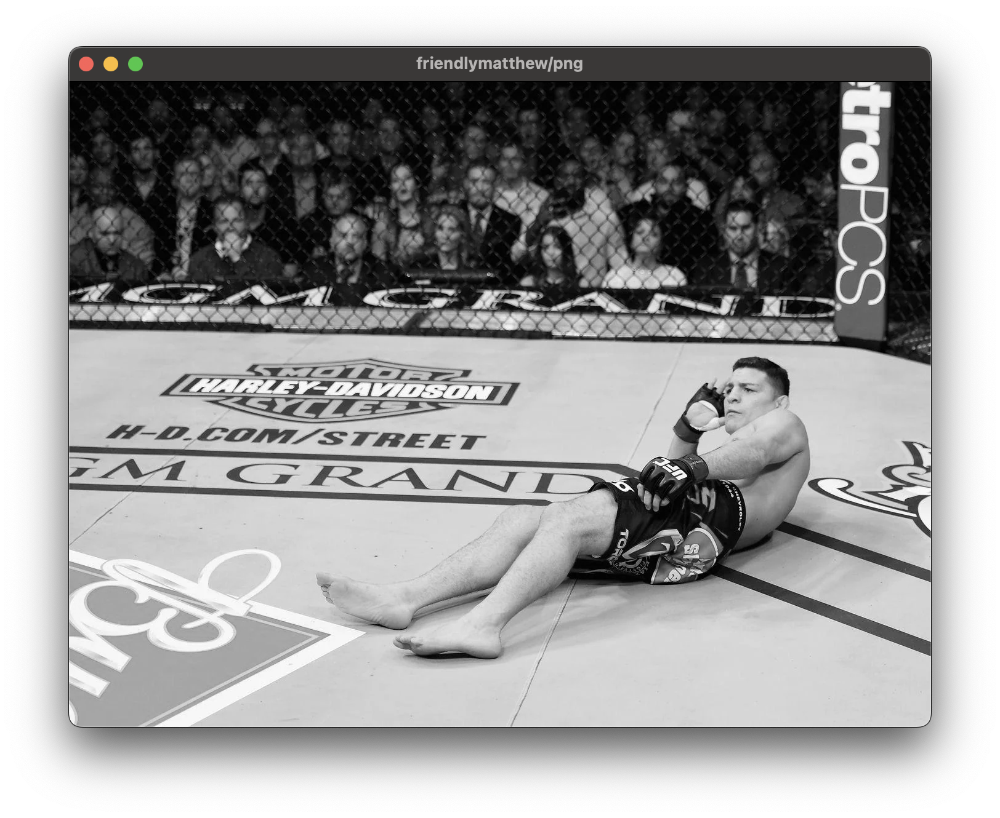
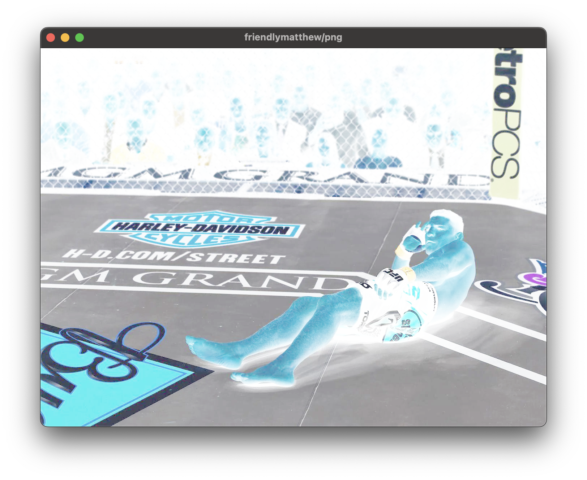
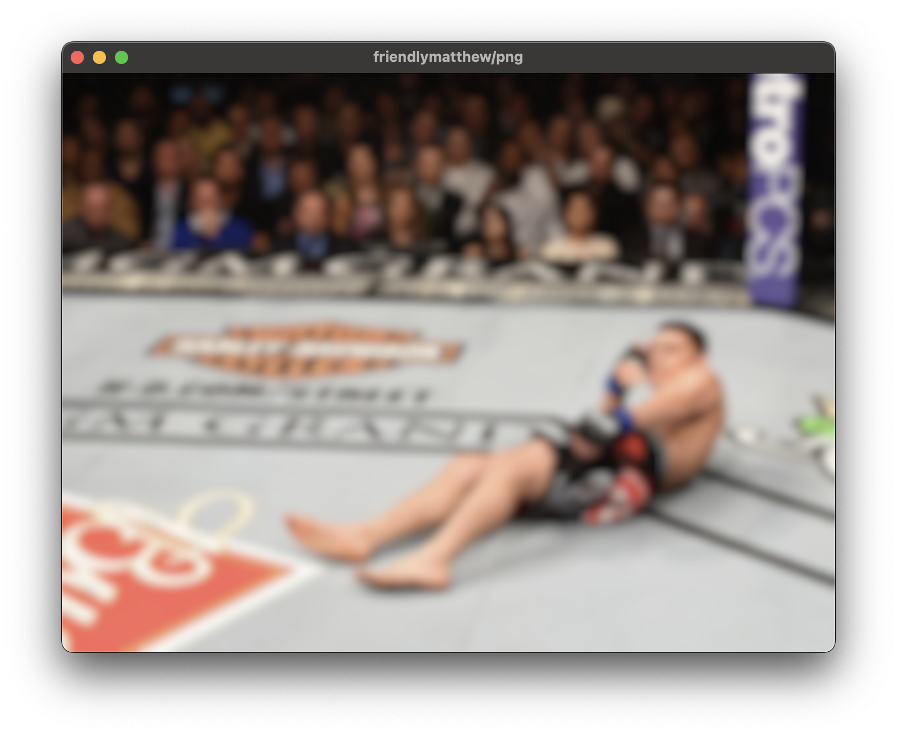
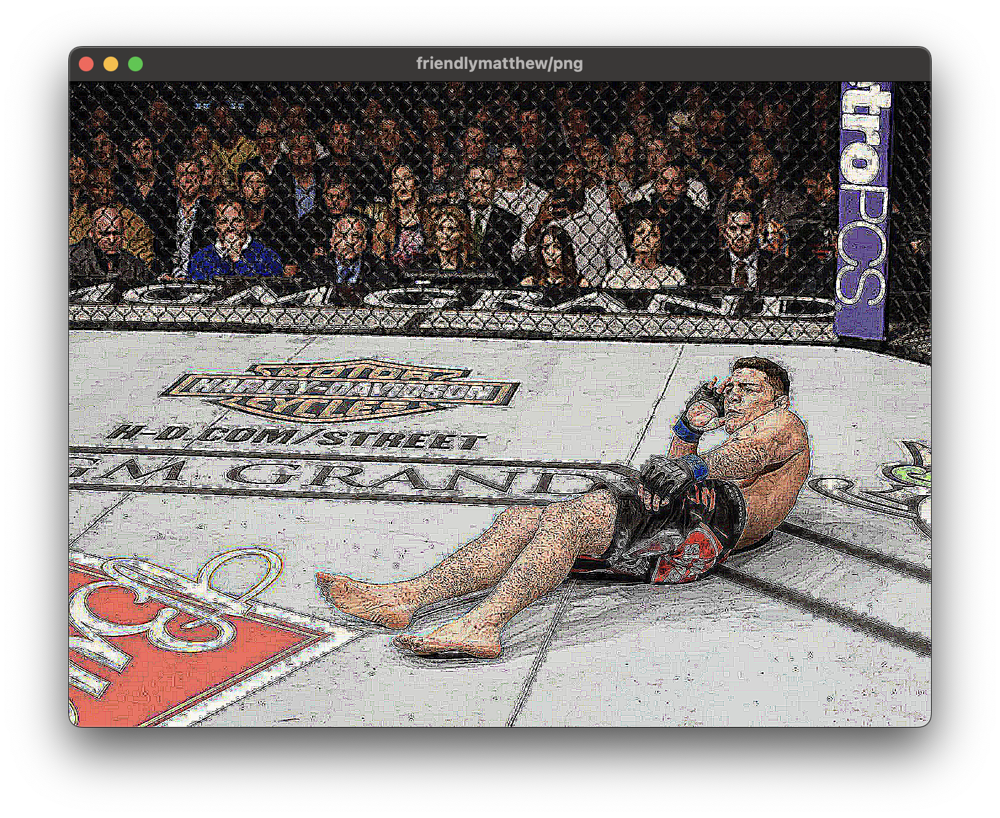
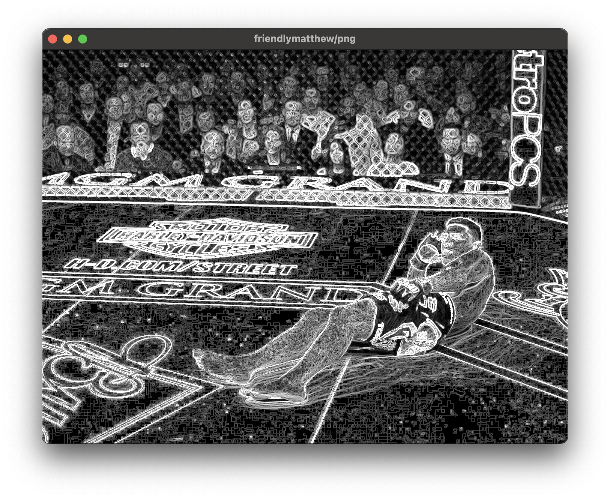

# Features

To follow along, run the following:

```sh
cd png && cargo r --release nick-diaz.png
```

## Color tones

### Grayscale

Press <kbd>G</kbd> to grayscale.



### Invert

Press <kbd>I</kbd> to invert colors.



## Convolution Filters

### Blur

Press <kbd>B</kbd> to blur. It applies a Gaussian blur. Use the <kbd>ArrowUp</kbd> and <kbd>ArrowDown</kbd> to control
the blur radius. Defaults to 21.



### Sharpen

Press <kbd>S</kbd> to sharpen. It uses a Laplacian-based sharpening filter. Use the <kbd>ArrowUp</kbd> and <kbd>
ArrowDown</kbd> to control the sharpening factor. Defaults to 16.



### Detect edges

Press <kbd>E</kbd> to enhance the edges in an image. It applies a Sobel filter.

